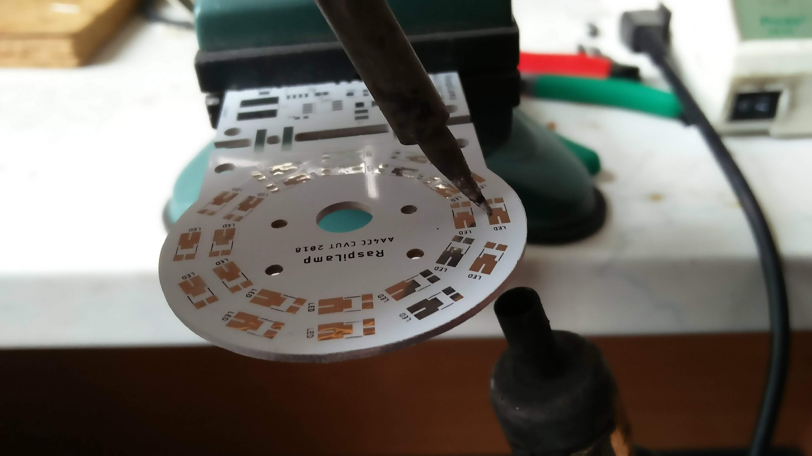

# Raspberry Pi Camera Lamp

## Overall concept

The main part of the light are two branches with 12 LEDs each. They are arranged in 2 concentric circles. In the centre of these circles there is a hole (7mm diameter) for camera lens. In the space between this hole and the LEDs there are 4 mounting holes for attaching the camera to the board. Beneath this "circular" part there is a "rectangular" part of the light controller. Taking from left to right, there are two inductors, two Schottky diodes, two LED drivers, two resistors and two capacitors and the data (PWM) connector, the power connector and a trimmer and a solder jumper. There are altogether 6 holes for mounting the whole module (light board + camera) to a holder. The wiring is based on a schematic shown in the datasheet of the AP8801 driver.

Here you can see the [3D model of the board](https://a360.co/2OzGw6O).

Here is the [schematic and board](https://cadlab.io/project/1334).

## Components
 (numbers hold for one board)

 |	Part				|	Manufacturer	|	Manufacturer No.		|	Farnell/Mouser Ref.			|	Pieces	|
 |	-----				|	-----			|	-----					|	-----						|	-----	|
 |	LED 				|	OSRAM			|	DURIS E5 GW-JDSTS2.EM 	|	<https://bit.ly/2IO0KUW>[!]	|	24		|
 |	LED driver 			|	DIODES 			|	AP8801 					|	<https://bit.ly/2E9jP5u>	|	2		|
 |	Capacitor 			|	TAIYO YUDEN 	|	HMK325BJ475KN-TE 		|	<https://bit.ly/2Oex5dw> 	|	2		|
 |	Inductor 			|	BOURNS 			|	SRN8040TA-101M 			|	<https://bit.ly/2NzDQ4y> 	|	2		|
 |	Resistor 1R1		|	KOA SPEER 		|	RK73H1JTTD1R10F 		|	<https://bit.ly/2QF4E5e>	|	2		|
 |	Schottky Rectifier 	|	VISHAY 			|	SS1H10-E3/61T 			|	<https://bit.ly/2ywoOXw>	|	2		|
 |	Trimmer 			|	BOURNS 			|	TC33X-2-103E 			|	<https://bit.ly/2yaW6MC>	|	1		|

The values of the components were determined based on the LED driver (AP8801) datasheet.

### Connectors

- POWER-1 - +48V
- POWER-2 - GND
- CTRL-1 - GND
- CTRL-2 - RASPBERRY Pi PWM 
- CTRL-3 - RASPBERRY Pi PWM 

## Assembly

As our light board is made of aluminium and the heat dissipates massively, we recommend to solder the LEDs as shown in the following picture:

The board is heated with hot air from beneath and the solder pad gets heated from the soldering iron.